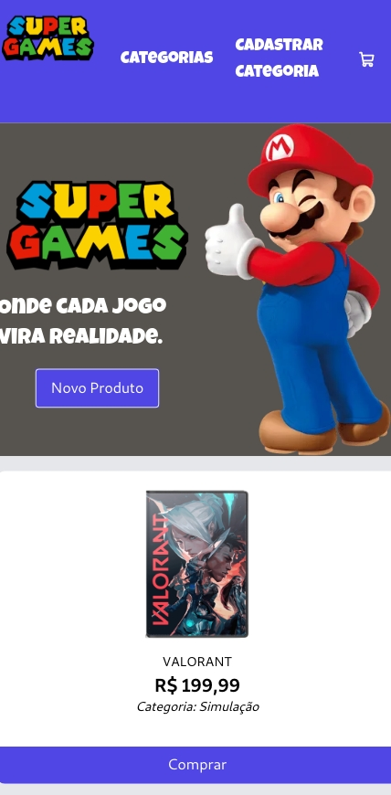

# 🕹️ Frontend Loja de Games — Generation Brasil

Projeto desenvolvido como parte da formação na **Generation Brasil**, com o objetivo de consumir uma API REST e exibir os dados em uma interface moderna e funcional.

---

## 📄 Descrição

Este projeto consiste no **Frontend** de uma Loja de Games, consumindo os dados disponibilizados por uma API pública hospedada no Render.

Projeto desenvolvido como parte de uma avaliação na formação da **Generation Brasil**, com o objetivo de consumir uma API REST e exibir os dados em uma interface moderna e funcional.

A API pode ser acessada e testada diretamente via Swagger:  
➡️ [https://lojagames-nest.onrender.com/swagger](https://lojagames-nest.onrender.com/swagger)

O projeto foi desenvolvido utilizando:  
- **React** com **Vite**  
- **TypeScript**  
- Requisições HTTP com **Axios**

---

## 💻 Funcionalidades

- Exibição de uma lista de games, consumidos da API.
- Interface moderna e responsiva.
- Componentização com React.
- Tipagem estática com TypeScript.
- Consumo de API utilizando `axios`.

---

## 🌐 Deploy

https://lojasupergames.vercel.app/

---

## ⚠️ Observações Importantes

A API está hospedada no Render, que pode demorar alguns segundos para "acordar" quando está inativa.

➡️ Para garantir que os produtos carreguem corretamente:

1. Acesse primeiro a documentação da API:
https://lojagames-nest.onrender.com/swagger

2. Aguarde até que a página carregue completamente e os endpoints fiquem disponíveis.

3. Em seguida, abra a aplicação na Vercel ou rode o projeto localmente.

Assim, você evitará problemas de timeout ou carregamento incompleto de produtos.

---

## 🖼️ Imagens da Aplicação


Aqui eu deixei um screenshot da aplicação (na visão para celulares) para mostrar a interface. Exemplo:



---

## ⚙️ Instalação e Execução Local

Para rodar o projeto localmente, siga os passos abaixo:

```bash
git clone https://github.com/Gabriel-Aranda1406/-loja_games_react
cd -loja_games_react
yarn
vite


